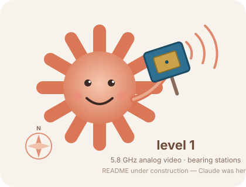

  

<h1 align="center">drone-mesh-custom · level 1</h1>

  Detection stations for drones that broadcast nothing detectable but their 5.8&nbsp;GHz analog video link. 
  A XIAO ESP32-C5 is the receiver, four patch antennas on an RF switch give a compass bearing, 
  and two stations' bearings cross into a position on the mapper.

<em>This README is a placeholder while the branch takes shape.</em>

| Where | What |
|---|---|
| [`level1-c5phy/`](level1-c5phy/) | Station firmware for the Seeed XIAO ESP32-C5 (PlatformIO) and its desktop tests |
| [`docs/Level1-Station-v3-C5PHY-Bench-Guide.pdf`](docs/Level1-Station-v3-C5PHY-Bench-Guide.pdf) | Hardware, wiring, BOM, calibration and the bench procedure, with the optional LNA + filter stage |
| `mesh-mapper.py` | The shared mapper. The version with level 1 bearing support is on [`level2-main`](../../tree/level2-main) |

Level 2 (Remote ID, DJI DroneID, MAVLink, fingerprints) is on [`level2-main`](../../tree/level2-main).
